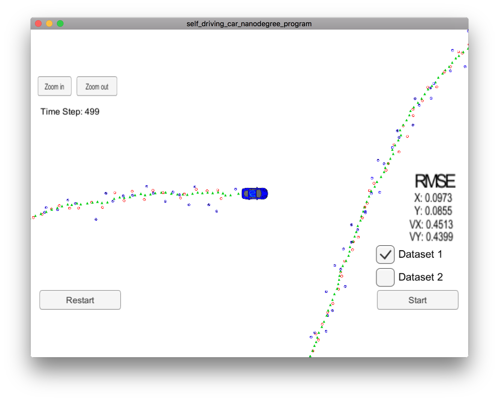

# Extended Kalman Filter Project

Overview
---
This repository contains my submission for the Extended Kalman Filter Project, which is part of the curriculum for term 2 of the Udacity Self-Driving Car Engineer Nanodegree Program. The goal of this project is to implement a Kalman Filter in C++ and verify its correct functioning using data provided by Udacity.

[//]: # (Image References)

[image1]: ResultScreenshot.png "Result Screenshot"

### Results
Looking at the screenshot of the Udacity simulator above you can see that my Kalman Filter is working correctly. The red and blue circles are simulated LIDAR and Radar readings. The green triangles represent the predicted position from my Kalman Filter. Notice that the green triangles trace a smooth and consistent path even though there is a substantial amount of noise in the sensor readings. I achieved the following Root Mean Square Error (RMSE) when running my extended Kalman Filter with Dataset 1. These values are within the tolerances from the rubric:

| X Vector  | RMSE      | 
|:-----:|:-------------:|
| X  | 0.0973  | 
| Y  | 0.0855  |
| VX  | 0.4513  | 
| VY  | 0.4399  |
